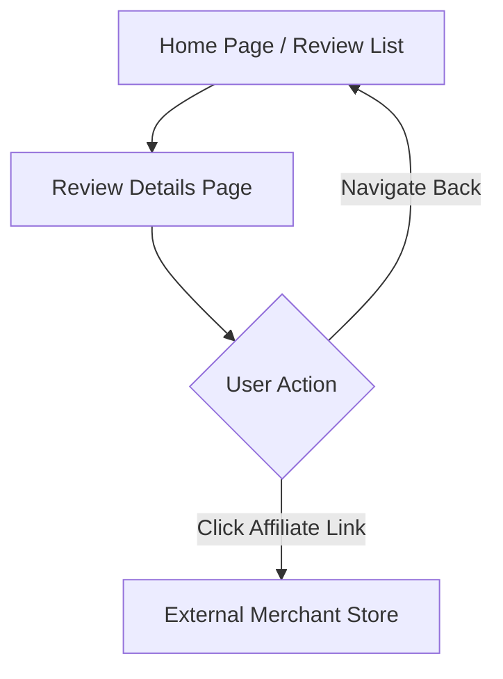

## 1. Product Overview
The **Review Details Page** is a dynamic page designed to display in-depth product reviews. It serves as the core content consumption area where users read detailed analyses, view product specifications, and decide whether to purchase via affiliate links.

## 2. Core Features

### 2.1 User Roles
| Role | Registration Method | Core Permissions |
|------|---------------------|------------------|
| Visitor | No registration | View reviews |
| Author | Email/Social Login | Create and edit own reviews |

### 2.2 Feature Module
The requirements consist of the following main pages:
1. **Home page**: List of reviews.
2. **Review Details Page**: Displays the full review content.
3. **Login/Register**: User authentication.
4. **Dashboard/Editor**: Create and edit reviews.

### 2.3 Page Details
| Page Name | Module Name | Feature description |
|-----------|-------------|---------------------|
| **Review Details Page** | Header Section | Displays the review title, publication date, author, category, and a hero image. |
| | Specs Panel | A section or sidebar displaying key technical specifications (e.g., dimensions, weight, connectivity) derived from the frontmatter. |
| | Content Body | Renders the main MDX content, supporting rich text, images, and standard markdown formatting. |
| | Verdict & CTA | A distinct section (bottom or sidebar) summarizing the review with a final rating, price, and a prominent "Buy Now" affiliate link button. |

## 3. Core Process

## 4. User Interface Design
### 4.1 Design Style
- **Style:** Clean, content-focused layout with high readability.
- **Colors:** Neutral background for content, accent colors for ratings and CTA buttons.
- **Typography:** Sans-serif for headings, serif or readable sans-serif for body text.

### 4.2 Page Design Overview
| Page Name | Module Name | UI Elements |
|-----------|-------------|-------------|
| **Review Details Page** | Layout | Responsive layout. On desktop: Content on the left/center, sticky sidebar for Specs/Verdict (optional) or single column with Verdict at bottom. |
| | Rating | Visual representation of the score (e.g., 8.5/10 badge). |
| | CTA Button | High-contrast button for the affiliate link. |

### 4.3 Responsiveness
- **Mobile-Adaptive:** The layout stacks vertically on mobile devices. The sidebar (if any) moves to the bottom or becomes a collapsible section.
