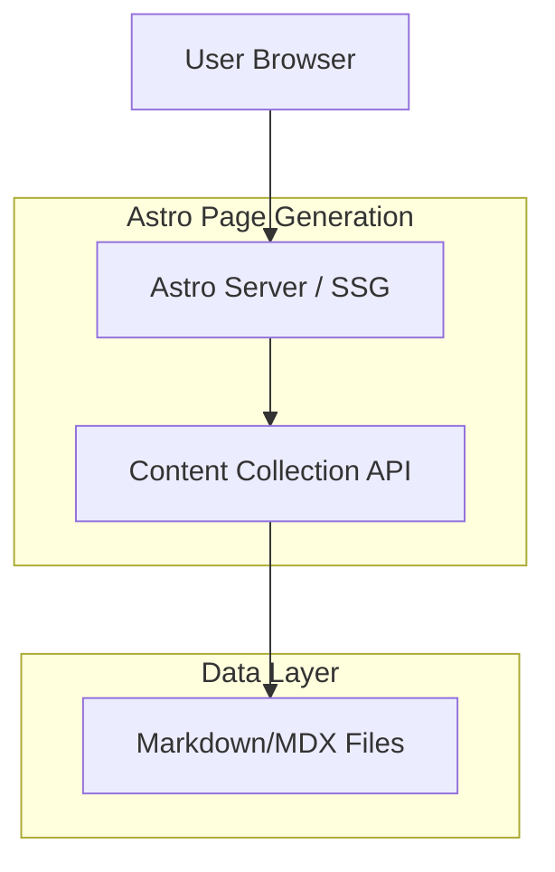

## 1. Architecture design

## 2. Technology Description
- **Framework:** Astro (v5.x)
- **Styling:** TailwindCSS (v3.x)
- **Content:** MDX (Markdown + JSX)
- **Language:** TypeScript

## 3. Route definitions
| Route | Purpose |
|-------|---------|
| `/reviews/[...slug]` | Dynamic route for individual review pages. Generates paths based on the MDX file slugs in `src/content/reviews`. |

## 4. Data Model (Content Collection)
The data is managed via Astro Content Collections.

### 4.1 Schema Definition (`src/content/config.ts`)
The `reviews` collection schema includes:
- `title` (string): Review title.
- `date` (date): Publication date.
- `author` (string): Reviewer name.
- `image` (string): Cover image URL.
- `rating` (number): Score from 0-10.
- `summary` (string): Short summary/verdict text.
- `price` (string): Current price display.
- `affiliateLink` (string): URL to the merchant.
- `category` (enum): Product category.
- `specs` (record): Key-value pairs for technical specifications.

## 5. Implementation Details
- **Dynamic Routing:** Use `getStaticPaths` to generate pages for all entries in the `reviews` collection.
- **Rendering:** Use `<Content />` component obtained from `entry.render()` to display the MDX body.
- **Layout:** Wrap the page in `MainLayout.astro`.
