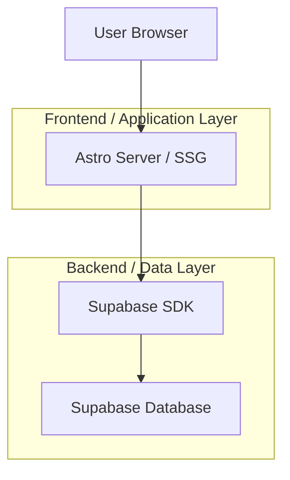
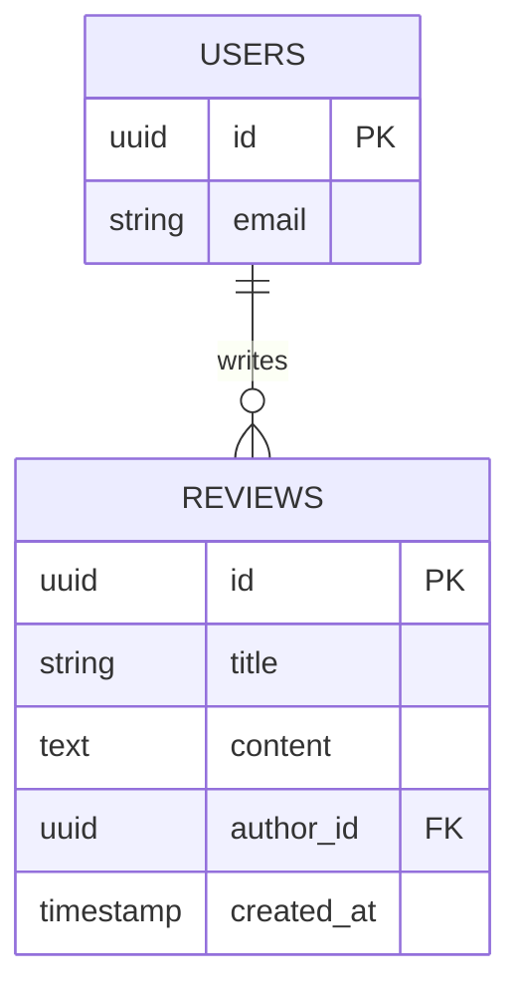

## 1. Architecture design



## 2. Technology Description
- **Framework:** Astro (v5.x)
- **Styling:** TailwindCSS (v3.x)
- **Language:** TypeScript
- **Backend/Database:** Supabase (PostgreSQL + Auth)

## 3. Route definitions
| Route | Purpose |
|-------|---------|
| `/reviews/[...slug]` | Dynamic route for individual review pages. Generates paths based on the MDX file slugs in `src/content/reviews`. |

## 4. Data Model (Content Collection)
The data is managed via Astro Content Collections.

### 4.1 Schema Definition (`src/content/config.ts`)
The `reviews` collection schema includes:
- `title` (string): Review title.
- `date` (date): Publication date.
- `author` (string): Reviewer name.
- `image` (string): Cover image URL.
- `rating` (number): Score from 0-10.
- `summary` (string): Short summary/verdict text.
- `price` (string): Current price display.
- `affiliateLink` (string): URL to the merchant.
- `category` (enum): Product category.
- `specs` (record): Key-value pairs for technical specifications.

## 6. Data model

### 6.1 Data model definition


### 6.2 Data Definition Language
Reviews Table
```sql
-- create table (implied base structure)
CREATE TABLE reviews (
    id UUID PRIMARY KEY DEFAULT gen_random_uuid(),
    title TEXT,
    content TEXT,
    -- ... other fields
    created_at TIMESTAMP WITH TIME ZONE DEFAULT NOW()
);

-- add author_id column
ALTER TABLE reviews 
ADD COLUMN author_id uuid REFERENCES auth.users(id);

-- Security Policies (RLS)
ALTER TABLE reviews ENABLE ROW LEVEL SECURITY;

-- Policy: Allow insert for authenticated users
CREATE POLICY "Permitir insert para autenticados" 
ON reviews FOR INSERT 
TO authenticated 
WITH CHECK (auth.uid() = author_id);

-- Policy: Allow update only for author
CREATE POLICY "Permitir update para autor" 
ON reviews FOR UPDATE 
TO authenticated 
USING (auth.uid() = author_id);
```
